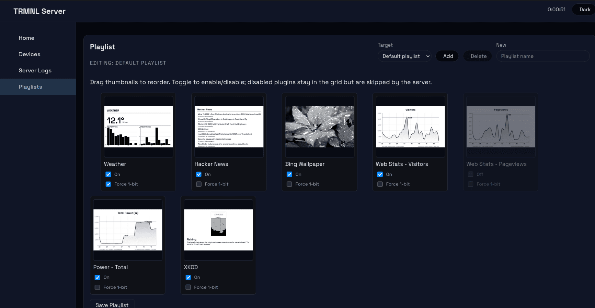

# TRMNL Local Server

This is a self-hosted FastAPI backend that emulates the TRMNL cloud so e-paper devices can fetch fresh images and metadata from your local network.



It is loosely based on a Flask implementation by [@ohAnd](https://github.com/ohAnd/trmnlServer), rewritten (nearly) from scratch to use FastAPI, async I/O, and a plugin-driven architecture for rendering various charts and images, prioritizing greyscale output suitable for later firmware versions but allowing you to force 1-bit BMP for legacy devices on a per-item basis

The server maintains device/playlists in SQLite, renders plugin-driven charts/photos into BMP/PNG assets, and exposes `/api/display` plus legacy-compatible endpoints expected by the firmware.

It also tries too hard to do image color grading and dithering to improve the appearance of photos and complex graphics on e-ink panels, which is a rabbit hole I fell into.

## Non-Goals

- **Full feature parity with the official TRMNL cloud** – this is a lightweight server for personal use, not a 1:1 clone of the official backend.
- **Advanced security features** – while SSL is supported (but disabled by default to save battery), user authentication, multi-user support, and other advanced features are out of scope. This is intended to be deployed behind a reverse proxy.
- **Extensive plugin library** – only a few example plugins are provided; users are encouraged to write their own.
- **Web dashboard for management** – a minimal static UI is included for previewing plugin outputs and doing basic playlist management, but no full-featured admin panel.
- **Browser-based rendering** – all image generation is done server-side using Python libraries to minimize system requirements.

## Highlights

- **FastAPI core** – `trmnl_server/main.py` hosts the HTTP API, static assets under `/web`, and middleware-level request logging.
- **Plugin rendering pipeline** – classes in `plugins/` generate images (always 1-bit and 2-bit) using Pillow, httpx, pandas, etc. Just output an image and the server handles (configurable) dithering, grading, and persistence.
- **Device + playlist persistence** – SQLAlchemy models in `models.py` keep per-device rotation state, playlists, logs, and battery samples in `var/db/trmnl.db`.
- **Autodiscovered plugin scheduler** – background workers keep assets fresh; see **Plugins & registry** for discovery rules and toggles.
- **Firmware compatibility** – `/api/display` always returns a single `image_url` plus a changing `filename` token so ESP32-based firmware knows when to refresh.
- **Batteries-included tooling** – `Makefile` wraps `make serve` (launch FastAPI via `python -m trmnl_server`) and `make test` (pytest). Plugins can be previewed via helper scripts under the repo root.
- **Color grading + dithering** – "color" grading and multiple dithering algorithms are available to improve image quality on e-ink panels, and you can force specific playlist entries to use 1-bit BMP output if needed.

## Deployment

I am deploying this with `kata`, a Docker-based service manager I wrote, but any method that can run a FastAPI app will work.

## Running Locally

```bash
git clone https://github.com/rcarmo/trmnlServer.git
cd trmnlServer
python3 -m venv .venv && source .venv/bin/activate
pip install -r requirements.txt
make serve
```

The server logs which port it binds to (default `SERVER_PORT=4567`). Point your TRMNL device at `http://<server_ip>:<port>`.

Useful commands:

- `make serve` – start FastAPI using the current working directory as the runtime root.
- `SERVER_PORT=8081 make serve` – override port for quick tests.
- `make serve ARGS=/path/to/workdir` – run the server against a different working directory (`var/` contents plus SSL/generated assets) without touching your source tree.
- `python -m trmnl_server --list-plugins` – print the plugin registry (names + defaults) and exit.
- `python -m trmnl_server --run-plugin WeatherPlugin --plugin-output /tmp --plugin-arg image_root=/path` – run a single plugin once for debugging with optional keyword arguments.
- `make test` – run `pytest` (`tests/test_rotation.py`, `tests/test_plugins.py`, `tests/test_weather.py`).

## Configuration

All settings come from environment variables:

- `SERVER_PORT`, `ENABLE_SSL` – networking defaults (4567/False out of the box, set `ENABLE_SSL=true` when you need TLS).
- `IMAGE_PATH`, `REFRESH_TIME`, `DITHERING_MODE` – rendering and dithering behaviour.
- `PHOTO_GRADING_ENABLED` – enable/disable photographic grading for image-heavy plugins (default: true).
- `EINK_TONE_POINTS`, `EINK_TONE_GAMMA` – optional grayscale response compensation points/gamma for panel-space quantization.
- `BATTERY_MAX_VOLTAGE`, `BATTERY_MIN_VOLTAGE`, `TIME_ZONE` – telemetry scaling.
- `SETUP_API_KEY`, `SETUP_FRIENDLY_ID`, `SETUP_MESSAGE` – `/api/setup` payload fields.
- `ASSETS_ROOT`, `STATIC_ROOT`, `GENERATED_ROOT` – relative directories (inside the working dir) for dashboard assets and generated BMP/PNG output (defaults: `web`, `web`, and `var/generated`).
- `CALIBRATION_PLUGIN_ENABLED` – set to `false` to remove calibration plugins from the registry and skip generating calibration assets.

Whenever a setting is changed via the `/settings/*` endpoints, the new value is written to SQLite (table `config_entries`). On startup, `config.py` loads environment variables first (highest precedence) and then applies any persisted entries that are not overridden by the environment, so API-driven tweaks survive restarts without fighting `SERVER_PORT=...` overrides in your shell.

Not all settings are exposed in the Web UI (yet); refer to `config.py` for the full list.

Runtime artefacts live under `var/` inside your chosen working directory:

- `var/db/trmnl.db` – SQLite database plus future state.
- `var/logs/` – reserved for future log sinks.
- `var/generated/` – plugin BMP/PNG output served via `/generated/*`.
- `var/ssl/` – self-signed certs generated automatically if SSL is enabled.

FastAPI creates these directories during startup if they are missing, and `.gitignore` keeps `var/` out of version control.

## Plugins & registry

- Plugins are auto-discovered from `trmnl_server/plugins/` by the scheduler; any class inheriting `PluginBase` with `AUTO_REGISTER=True` is registered.
- Set `AUTO_REGISTER = False` on a plugin class to opt it out of the registry.
- Set `CALIBRATION_PLUGIN_ENABLED=false` (ENV or `/settings`) to remove all calibration plugins from the registry and skip generating calibration assets.
- `python -m trmnl_server --list-plugins` shows the active registry; `--run-plugin <Name>` respects these toggles.

## API + Static Surface

| Path                                          | Description                                                                                    |
| --------------------------------------------- | ---------------------------------------------------------------------------------------------- |
| `GET /api/display`                            | Main firmware endpoint: returns `image_url`, `filename`, refresh hints, and playlist metadata. |
| `POST /api/log`                               | Device log ingestion recorded via SQLAlchemy.                                                  |
| `POST /api/battery`                           | Battery + RSSI samples persisted to `BatteryStatus`.                                           |
| `GET /image/screen.bmp` / `screen1.bmp`       | Alternating BMP endpoints to break caches.                                                     |
| `GET /image/grayscale.png` / `grayscale1.png` | Optional grayscale preview for firmware that supports it.                                      |
| `GET /web/*`                                  | Static dashboard assets (HTML/JS/CSS/fonts and fallback imagery).                              |
| `GET /generated/*`                            | Runtime plugin output (BMP/PNG) served as-is.                                                  |

The UI under `web/` shows plugin output previews and rotation metadata; templates in `templates/` are used by specific plugins (e.g., weather renderer).
